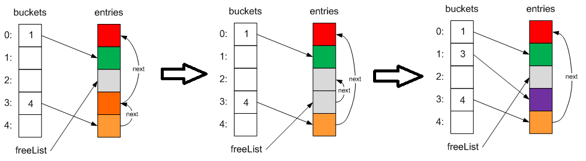

+++
title = "Making C# Dictionary twice as fast."
description = "A way to optimize how the Dictionary type works in the C# programming language."
date = 2025-04-18
updated = 2025-04-18
taxonomies = { tags = ["dotnet","csharp","dictionary", "cs"], categories = [] }

draft = false
in_search_index = true

[extra]
# badge = "NEW"  # Options: NEW, BETA, UPDATED, WIP
+++

Let's talk about how to optimize the performance of the `Dictionary` type in C#.

This data type is one of the most popular .NET collection types, and using it correctly can significantly improve your application's performance. First we'll go over a bit of theory on how a dictionary works, and then we'll look at ways to speed up the insertion of elements.

## How does Dictionary work?

Before we get to optimization, let's understand how `Dictionary` actually works.

A dictionary is an implementation of a standard hash table. The whole point of it is to unambiguously associate a key with its value. And every time we look something up by that key, we should always get back the same value. Keys can be either reference types or value types. Initialization happens either at creation time (if an initial collection size was passed in), or when the first element is added, in which case the nearest prime number is chosen as the size. In the process, two internal collections are created — **int[] buckets** and **Entry[] entries**.

```cs
public class Dictionary<TKey, TValue> :
    IDictionary<TKey, TValue>,
    ICollection<KeyValuePair<TKey, TValue>>,
    IEnumerable<KeyValuePair<TKey, TValue>>,
    IEnumerable,
    IDictionary,
    ICollection,
    IReadOnlyDictionary<TKey, TValue>,
    IReadOnlyCollection<KeyValuePair<TKey, TValue>>,
    ISerializable,
    IDeserializationCallback
    where TKey : notnull
  {
    #nullable disable
    private int[] _buckets;
    private Dictionary<TKey, TValue>.Entry[] _entries;
    private ulong _fastModMultiplier;
    private int _count;
    private int _freeList;
    private int _freeCount;
    private int _version;
    private IEqualityComparer<TKey> _comparer;
    private Dictionary<TKey, TValue>.KeyCollection _keys;
    private Dictionary<TKey, TValue>.ValueCollection _values;
```

The first collection holds the indices of elements in the second one, which in turn holds the actual elements, shaped like this:

```cs
    private struct Entry
   {
     public uint hashCode;
     public int next;
     public TKey key;
     public TValue value;
   }
```

When an element is added, the hash code of its key is computed, and then the index of the bucket it will go into is derived from that hash modulo the collection's size. Next, it's checked whether that key already exists in the collection — if it does, the `Add` operation throws an exception, whereas assigning by index simply replaces the existing element with the new one.

```cs
// throws an exception
dictionary.Add(10, 20);

// just replaces the value with the new one
dictionary[10] = 20;
```

If the dictionary has reached its maximum size, it gets resized (a new size is chosen — twice the previous one, rounded up to the nearest prime number). After that, the old dictionary is fully copied into the newly allocated space, and the old memory region becomes eligible for garbage collection. The complexity of this operation is, accordingly, O(n).

If a collision occurs (there's already an element in the `_buckets` index slot), the new element is added to the collection, its index is stored in the bucket, and the index of the old element is stored in the new element's `next` field.



As a result, we end up with a singly linked list for keys that hash to the same value. This collision-resolution mechanism is called **chaining**. To avoid running into this, you need to pick a `GetHashCode` algorithm that produces values that are as unique as possible.

## The double-hashing problem

Suppose we need to insert some value into a dictionary, but first check whether the key already exists — and if it does, return the value that's already stored there:

```cs
if (!dictionary.ContainsKey(key))
{
    dictionary[key] = value;
}
```

At first glance, this looks like a perfectly logical solution. But the problem is that this results in **double hashing**:

1. Calling `ContainsKey` computes a hash to check whether the key exists.
2. Adding the element computes the hash again.

This adds extra overhead, especially if the operation runs in a loop or on a hot path in your program.

## Solving it with TryGetValue

One way to reduce this problem is to use the `TryGetValue` method:

```cs
if (!dictionary.TryGetValue(key, out _))
{
    dictionary[key] = value;
}
```

This approach avoids the explicit `ContainsKey` call, but it still requires two accesses to the dictionary:

1. Checking whether the key exists.
2. Adding the value.

For instance, the `ConcurrentDictionary` class has a `GetOrAdd` method that doesn't suffer from this double-access problem.

How can we simplify this while keeping the same behavior? As a first step, we could wrap the double access in a separate `GetOrAdd` method and put the value-adding logic there.

```cs

public static class DictionaryExtensions
{
    public static TValue GetOrAdd<TKey, TValue>(this Dictionary<TKey, TValue> dictionary, TKey key, TValue value)
        where TKey : notnull
    {
        if (!dictionary.TryGetValue(key, out existedValue))
        {
            dictionary[key] = value;
            return value;
        }       
        return existedValue;
    }

}

```

But this doesn't actually solve the problem. We're still doing two key-lookup operations.

Can we do better?

## An efficient solution via CollectionMarshal

Yes, we can! Modern .NET has the `System.Runtime.InteropServices.CollectionsMarshal` class, which provides a `TryGetValueRefOrAddDefault` method. It lets you get a reference to a value by key, or add a value, in a single dictionary access. Here's an example of how to use it:

```cs
using System.Runtime.InteropServices;

public static TValue GetOrAdd<TKey, TValue>(this Dictionary<TKey, TValue> dictionary, TKey key, TValue defaultValue)
{
    ArgumentNullException.ThrowIfNull(dictionary);
    ref var slot = ref CollectionsMarshal.GetValueRefOrAddDefault(dictionary, key, out bool exists);
    if (exists) return slot!;

    slot = value;
    return value;
}
```

This method has been available since .NET 6. It's especially useful when you need to perform "get or add" operations in performance-critical parts of your code.

## Extending the functionality

Besides `GetOrAdd`, you can implement other useful methods for dictionaries, for example:

### TryUpdate

The `TryUpdate` method updates the value for a key if that key already exists:

```cs
public static bool TryUpdate<TKey, TValue>(this Dictionary<TKey, TValue> dictionary, TKey key, TValue value)
    where TKey : notnull
{
    ArgumentNullException.ThrowIfNull(dictionary);
    ref var slot = ref CollectionsMarshal.GetValueRefOrNullRef(dictionary, key);
    if (Unsafe.IsNullRef(ref slot)) return false;

    slot = value;
    return true;
}
```

You can build other extension methods for dictionaries the same way, for example:

### RemoveIfExists

Lets you remove a key if it exists.

```cs
public static bool RemoveIfExists<TKey, TValue>(this Dictionary<TKey, TValue> dictionary, TKey key)
    where TKey : notnull
{
    ArgumentNullException.ThrowIfNull(dictionary);
    // Get a reference to the value by key, or null if the key doesn't exist
    ref var slot = ref CollectionsMarshal.GetValueRefOrNullRef(dictionary, key);

    // If the reference isn't null, the key exists
    if (Unsafe.IsNullRef(ref slot)) return false; // The key doesn't exist, nothing to do

    dictionary.Remove(key); // Remove the key
    return true; // Return true, since the key was removed
}
```

### Upsert

Updates the value if the key exists, or adds a new value.

```cs
public static void Upsert<TKey, TValue>(this Dictionary<TKey, TValue> dictionary, TKey key, TValue value)
    where TKey : notnull
{
    ArgumentNullException.ThrowIfNull(dictionary);

    // Get a reference to the value by key, or default(TValue) if the key doesn't exist
    ref var slot = ref CollectionsMarshal.GetValueRefOrAddDefault(dictionary, key, out _);

    // If the key exists, update the value
    // If it doesn't exist, add the value
    slot = value;
}
```

## A practical example

Let's look at a practical example of using these methods:

```cs
var dictionary = new Dictionary<int, string>();
dictionary.GetOrAdd(1, "Value1");
dictionary.TryUpdate(1, "UpdatedValue1");

Console.WriteLine(JsonSerializer.Serialize(dictionary)); // {"1":"UpdatedValue1"}
```

As you can see, these methods make working with dictionaries more efficient and cleaner.

## Conclusion

Let's sum up:

- Using `ContainsKey` and `TryGetValue` can be inefficient due to double hashing.
- The `CollectionsMarshal` methods let you optimize how you work with dictionaries.
- Writing your own extension methods can make your code more convenient and performant.

Additional sources:

- [Link to the source code project](https://github.com/just-squad/just-platform-dotnet/blob/main/src/JustPlatform.Extensions/DictionaryExtensions.cs)
- [YouTube video](https://www.youtube.com/watch?v=6CWQXQISYpk)
</content>
