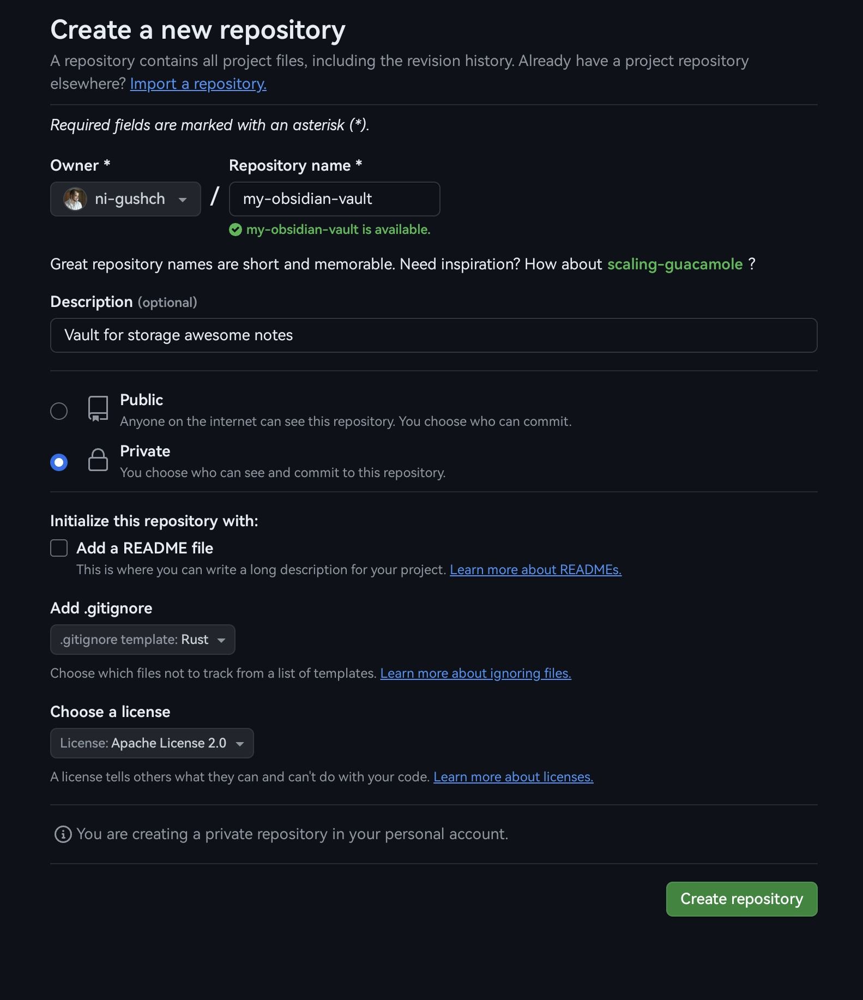
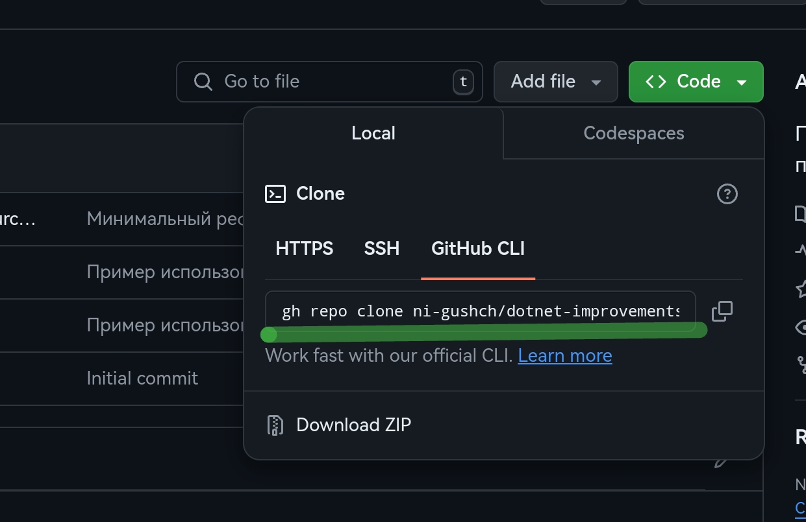
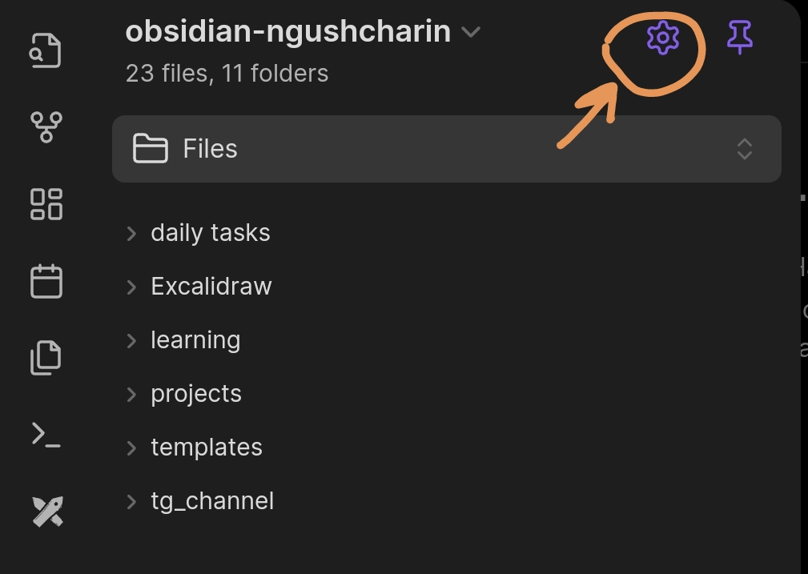
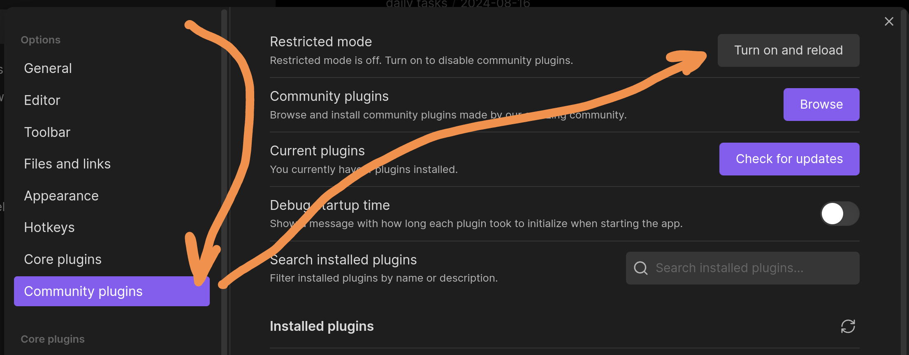
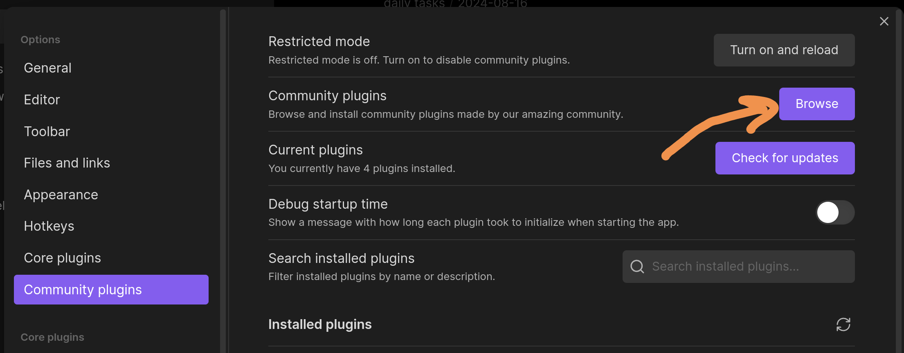
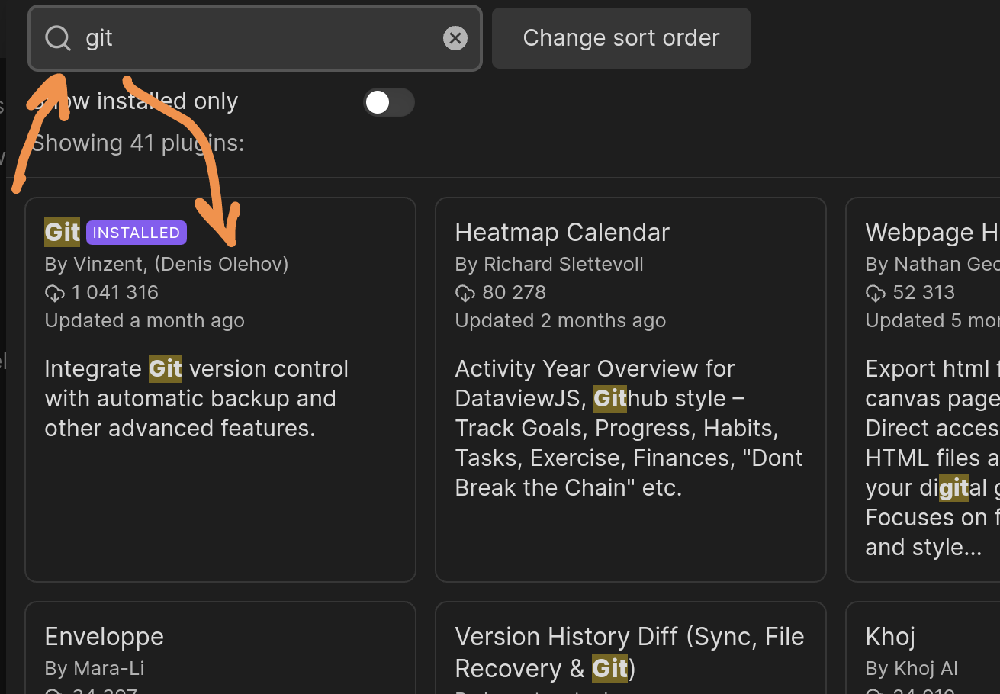
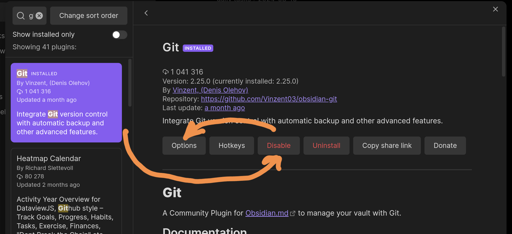
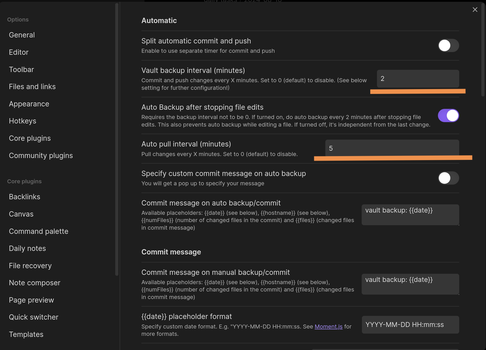
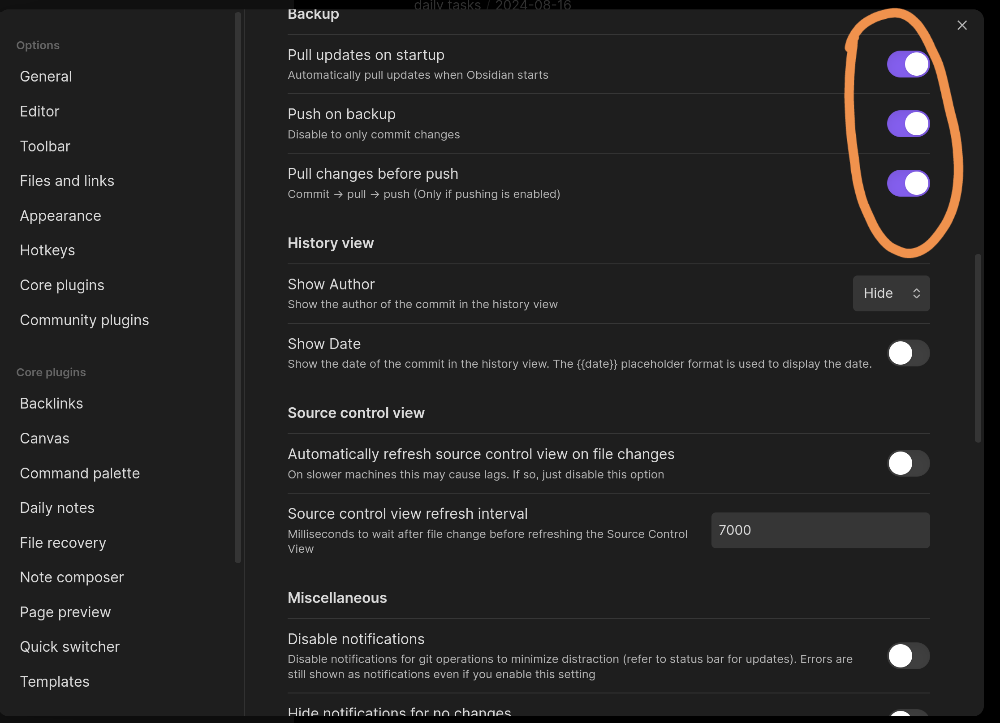
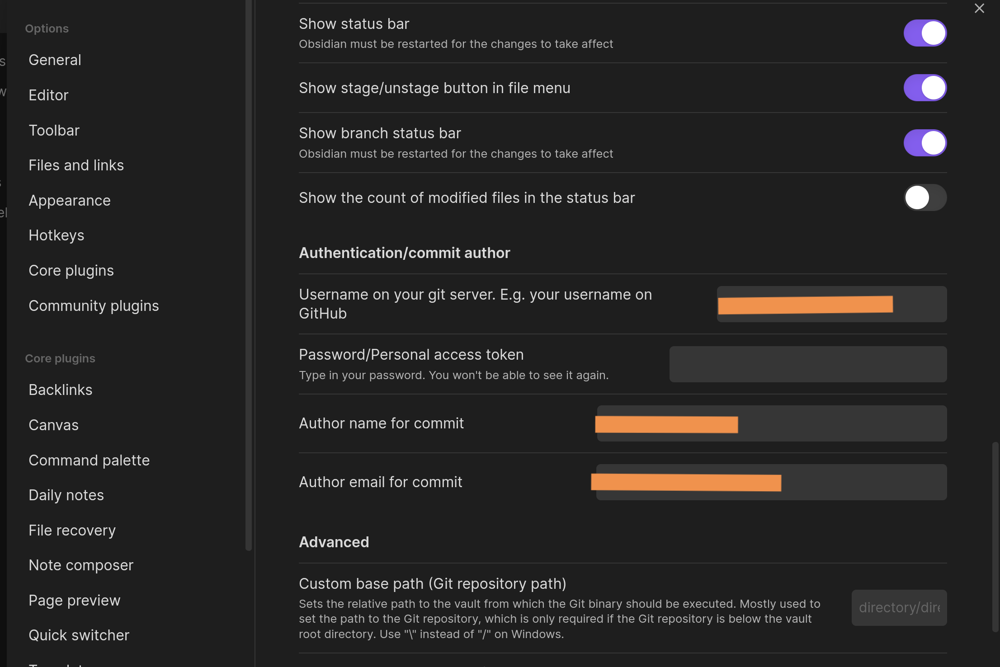

+++
title = "Obsidian. Git sync on Android."
description = "Ways to sync your Obsidian vaults on Android devices via Git."
date = 2024-08-18
updated = 2025-02-23
taxonomies = { tags = ["obsidian","git"], categories = [] }

draft = false
in_search_index = true

[extra]
# badge = "NEW"  # Options: NEW, BETA, UPDATED, WIP
+++

**Obsidian** is a very handy tool for keeping all kinds of notes. You can jot down a simple to-do list for the day, and some people use it to write scripts or draft entire books.

But using it raises the question of syncing your data. Sure, you could use the cloud sync built by Obsidian's developers, but sometimes you want independence from "the corporations." And **Obsidian** can give you that option.

There are two approaches: run a local sync server that uses CouchDB, or use the Git version control system.

This article covers how to set up vault syncing via Git on Android devices.

## Preparation

Whichever approach we go with, we need a repository to store all the documents in. So head over to wherever you'll be creating the repository (GitLab, GitHub...), log in, and create an empty private repository. To get a branch created automatically, you can add a `.gitignore` file to the repo right away.



Next we need to clone that repository onto the Android device somehow. Since Android has no built-in command-line support, we'll need a third-party app that emulates a Unix-style command line.

### Installing Termux and setting up Git

**Termux** is an open-source app that emulates a Linux command line, complete with package manager support. You can download it from [Google Play](https://play.google.com/store/apps/details?id=com.termux&hl=ru) or from the alternative [F-Droid](https://f-droid.org/packages/com.termux/) store, which only carries open-source apps. For more details, check their official [Wiki page](https://wiki.termux.com/wiki/Installation).

Now let's launch the app and start installing the packages we need.

```sh
pkg update && pkg upgrade -y && pkg install -y git openssh termux-api
```

Next, let's decide which folder our vault repositories will live in. As an example, we'll create a `repos` folder inside `Documents`.

```sh
mkdir ~/storage/shared/Documents/repos \
mkdir ~/storage/shared/Documents/repos/obsidian/
cd ~/storage/shared/Documents/repos/obsidian
```

Now we need to clone the repository into the folder we just created.

If our repository were public, there'd be no issue. But ours is private, so cloning it requires authentication first.

For GitHub, you can use their official CLI app, `gh`. To install it, run:

```sh
apt install gh
```

To authenticate on the website, use:

```sh
gh login
```

You'll need to pick an authentication method. I usually go with the browser option... after choosing your settings, you'll be dropped into a browser where you'll need to enter an additional code generated in the console.

Once connected, you'll get a link that looks like this:



Running it in the Termux console will clone the repository into whatever folder you're currently in.

```sh
gh repo clone <repo-link>
```

### Adding the vault to Obsidian

Once the repository is cloned, we can add that folder as a vault in Obsidian.

If you just downloaded the app, you'll see a "Choose folder as vault" button on the start screen. Tap it and point it at the folder that was created when the repository was cloned.

Now every file you add will be indexed by `git`, and you can push them to the remote repository.

That wraps up the preparation stage. Now let's look at the actual syncing methods.

## Using the Git plugin

The simplest approach. It works on any device, but the developers note it can be pretty unstable on mobile, since the plugin can't use the native Git CLI commands and instead relies on a JavaScript library that also happens to know how to work with Git.

It didn't work for me on the first try. But after successfully setting up sync via the command line, the plugin started working. I think that was just a coincidence. Let's walk through the steps.

### Installing the plugin

The plugin is developed by the community, so it's not part of `CorePlugins`. You first need to enable `Community plugins` support. To do that, tap the gear icon in the top-right corner of the menu.



Then enable `Community plugins` support, as shown in the screenshot.



Next, tap to browse the list of available plugins.



And search the list for a plugin named `Git`.



Tap the plugin -> Install -> Enable. The enable button will be in the same spot where the screenshot shows a "disable" button.



Next, head into the plugin's settings. I set the automatic repository update interval to: commit changes every 2 minutes, check for updates every 5 minutes. Since we're really only working on one device at a time, there's no need for instant updates.



Enable checking for updates on app startup, pushing changes after a local commit, and updating the local repository before pushing to the remote one (Pull before Push).



You'll also need to enter your login and password (a Personal Access Token for GitHub, which you can generate in your GitHub user settings), as well as your Git username and email.



Now your vault's repository will update automatically. You'll notice pop-up notifications appearing automatically describing each sync action.

## Using the Termux emulator

We're almost all set to implement this approach. The only thing left is to set your username and email, and configure an SSH key for syncing. Open the Termux app and run:

```sh
git config --global user.name <name>
git config --global user.email <email>
```

To get your SSH key, run:

```sh
cat ~/.ssh/id_rsa.pub
```

Copy what the command prints out, go to your user settings on GitHub or whichever repository host you use, and add it as an authentication SSH key.

The downside of this approach is that there's no automation at all — you'll have to type every command by hand. But on the plus side, it's guaranteed to work :D

Go into the folder where your vault lives:

```sh
cd ~/storage/Documents/repos/obsidian/my-obsidian-vault-repo
```

Update the remote repository's index:

```sh
git fetch --prune
git pull
```

> Note: instead of running `prune` every time to clean up the local index, you can set it globally:
>
> ```sh
> git config remote.origin.prune true
> ```

Once your local copy is synced with the remote one and you've added new files, you can push those changes to the remote repository. To do that, run:

```sh
git add .
git commit -m <message>
git push
```

That's how you can update the data in the remote repository by hand. But this approach isn't exactly convenient. Let's try to improve on it.

## Using Termux with the Tasker scheduler

If you've already gone through the steps above, you can pick up [THIS](https://github.com/DovieW/obsidian-android-sync/blob/master/README.md) guide starting at step 7, in the **Termux Setup** section.

The only difference in our case is that the folder the script gets cloned into will be slightly different:

```sh
git clone https://github.com/DovieW/obsidian-android-sync.git ~/storage/shared/Documents/repos/obsidian/obsidian-android-sync
```

The **upside** of this method is potential full automation, if you get all the settings right. And even if you can't get the Tasker app working, you're still left with a script you can call manually to sync your vault.

```sh
./sync-vaults.sh
```

This script automatically pulls changes from the remote repository, commits, and pushes them back to the remote.

The **downside** of this approach is that the **Tasker** app is PAID! And why would we want to handle syncing ourselves and pay for an app on top of that? But if you already own it, this method is for you.

## Using Termux with the cron scheduler

There's one more approach, which is really just an alternative to the previous one. Here we swap out the Tasker app for cron's scheduling capabilities. You can run and manage it right from within **Termux** itself.

To set this up, you can follow [this guide](https://www.reddit.com/r/ObsidianMD/comments/qep4gn/guide_obsidian_vault_github_sync_cron_on_termux/). You can reuse the same script we got from the previous method.

With cron, you can very flexibly configure your sync schedule.

That's it. We've covered a few ways to set up vault syncing through a Git repository.

If you still have questions, feel free to ask them under the posts in the [tg channel](https://t.me/bald_man_gushcharin).
